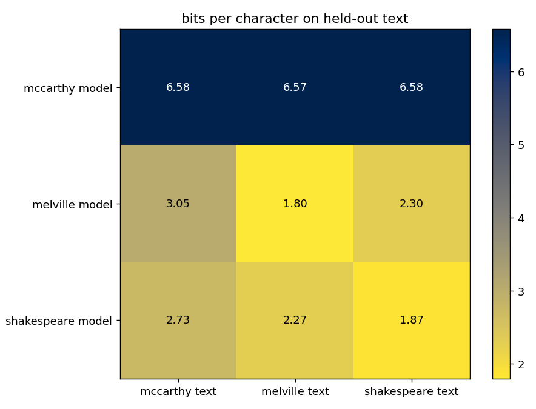
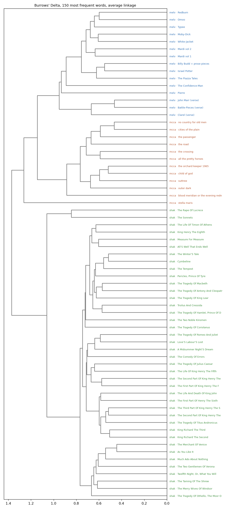

# persona-transformers

One small GPT per author, trained from scratch on that author alone. Then the
weights are opened and measured, to find out where the author actually lives
inside a model that only ever read them.

Three personas: **Shakespeare** (complete works), **Melville** (fourteen volumes
plus *Clarel*), **McCarthy** (twelve novels). Same architecture for all three:
nanoGPT's `shakespeare_char`, 6 layers, 6 heads, 384 wide, 10.66M parameters,
one shared 92-character vocabulary. Two controls sit beside them, a second
Shakespeare seed and a second Melville corpus, so every measurement can be
checked against the dice and against which books happened to go in.

## What the weights say

**The operators belong to the architecture, not the author.** Head layout,
singular-value spectra and Martin–Mahoney alpha come out the same for all six
models. Changing the random seed moves the attention layout as much as changing
the author. Every layer sits in the well-trained band; the MLP input matrix
reads 1.70–1.71 on all six models to the second decimal. The "spectrum that
moulds the model" is the training regime.

**The author lives in what the model predicts, and how deep it has to go to
predict it.** Cross-perplexity on held-out text, bits per character:

| model \ text | McCarthy | Melville | Shakespeare |
|---|---:|---:|---:|
| McCarthy | **1.47** | 2.55 | 3.12 |
| Melville | 2.74 | **1.85** | 2.24 |
| Shakespeare | 2.57 | 2.39 | **1.87** |

McCarthy and Shakespeare are the far pair; Melville sits between them, which
is also what plain compression distance and Burrows' Delta say about the raw
books. The distance is asymmetric: a model of the richer distribution reads
the sparer one better than the reverse. And the McCarthy model, which never saw
a sentence of his essays, predicts them 0.84 bits per character better than any
other author's model does.

The logit lens is the one structural signal that survives both controls:
McCarthy's text is decided earliest in the stack, Melville's needs the last two
blocks most, Shakespeare in between. Same six blocks, used to different depths.

**The models speak like the persona.** 256K characters sampled from each model
land inside its author's Delta cluster at the distance real books sit from each
other, and a blind reader attributed 48 of 48 shuffled samples to the right
author. What the judge named as tells (speech headings and *thou* for
Shakespeare, Latinate nautical prose and *said* for Melville, unquoted dialogue
and *aint* for McCarthy) are the same strata Delta's over-used words point at,
found independently.

**A quote corpus is the readers' author, not the author.** An earlier McCarthy
model trained on 1,985 public excerpts negated two to three times as often as
the others and answered *There is no* with *god*. Trained on the novels, it
negates least of all six and answers with *sound*, *longer*, *sign*. The
aphoristic, nihilistic McCarthy of Goodreads is a selection effect.




Full numbers, controls and caveats: [`FINDINGS.md`](FINDINGS.md). The report
every number comes from: [`out/REPORT.md`](out/REPORT.md). The papers that
shaped the methods, with what each one changed here: [`READING.md`](READING.md).

## What it does not claim

A 10M-parameter character model learns the statistical texture of a prose
style: sentence length, dialogue against narration, how far back a clause
reaches for its antecedent. That is the surface a worldview arrives through,
not the worldview. Both persona tests would pass a model producing
McCarthy-shaped nonsense, and at this size much of the output is exactly that.
"Decided earliest in the stack" is a fact about the model; reading it as a fact
about McCarthy's mind is a hypothesis to test by reading him.

The runs are 12–17 epochs over each corpus, far past the ~4 where repeated data
stops being free. A 4-epoch and depth 1/2/4 sweep is running; the first two
4-epoch results cost about 0.2 nats of validation loss each.

## Run

```bash
python3 scripts/fetch_corpus.py                 # Shakespeare + Melville from Project Gutenberg
python3 prepare.py                              # shared 92-char vocab -> data/<author>/{train,val}.bin
caffeinate -i -s python3 train.py shakespeare   # ~35 min on an M5 Pro (MPS) -> out/shakespeare/ckpt.pt
caffeinate -i -s python3 train.py melville
python3 investigate.py                          # out/REPORT.md, out/fig_*.png, out/investigation.json
python3 scripts/generate_samples.py             # 64 streams per model -> out/samples/
python3 scripts/stylometry.py                   # NCD + Burrows' Delta over books and samples
python3 scripts/blind_judge.py prepare          # 48 shuffled windows; `score` after judging
python3 sample.py melville --prompt "Call me "
```

Train under `caffeinate -i -s`: this Mac idles into maintenance sleep after a
minute and a sleeping run looks like a hang. Each run holds about 6.8 GB of
unified memory at batch 64, so on 24 GB run two at a time or pass
`--batch_size 32` for a third. `scripts/sweep.py` runs the epoch and depth
sweeps two at a time.

### McCarthy

Cormac McCarthy is in copyright, so nothing is fetched for him and no text of
his is in this repo. Put plain-text files of books you own in
`corpus/mccarthy/*.txt` (`scripts/convert_ebooks.py` converts ebooks you own),
then rerun `prepare.py`, `train.py mccarthy` and `investigate.py`. The pipeline
is author-agnostic: any directory under `corpus/` with `.txt` files becomes a
persona.

## What `investigate.py` measures

- **Spectra** of every learned operator: QK and OV circuits per head, MLP in
  and out, token and position embeddings. Singular values, effective rank,
  power-law decay, and Martin–Mahoney alpha on the eigenvalue tail.
- **Head layout** on held-out text: attention entropy, mean distance,
  previous-token mass, first-token sink, induction score.
- **Cross-perplexity** of every model on every author, plus probe texts no
  model trained on.
- **Logit lens**: bits per character if the model stopped after block *k*.
- **Residual stream** norms and the attention-to-MLP update ratio by block;
  the power spectrum of the position embeddings.
- **Worldview probe**: first word after eight shared prompts, 96 samples each.
  Kept as a smoke test; the counts are dominated by which books went in.

## Layout

```
train.py  model.py  prepare.py  sample.py  investigate.py
scripts/            fetch, convert, sweep, samples, stylometry, blind judge
corpus/<author>/    plain text (git-ignored)
data/<author>/      train.bin, val.bin (git-ignored)
out/<model>/        ckpt.pt (git-ignored), log.jsonl
out/                REPORT.md, investigation.json, stylometry.json, fig_*.png, judge/
FINDINGS.md         the results, with controls
READING.md          the literature and what each paper changed here
```
